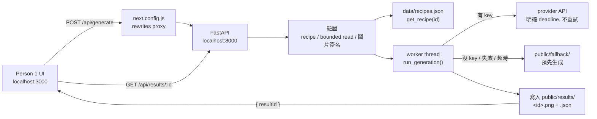

# MOSAIC 後端架構｜Person 2

> 定位：Person 2（Backend / AI / Systems）的執行計畫。
> 對應 [Buildday_prompt.md](Buildday_prompt.md) 第 140–214 行的責任範圍。
>
> **狀態（2026-09-20）：設計方向已選定；framework-free 核心可執行，但 HTTP server、Next.js proxy 與端到端流程尚未驗證。這不是 production-ready 架構。**

---

## 結論先講

**保留 Python（FastAPI）+ Next.js rewrite proxy；先完成一個 seed 的 cached 端到端流程，live 生成是最後才接的加分項。**

四個前提決定了底下所有事：

| 前提 | 後果 |
|---|---|
| Person 1 用 Next.js | 用 `next.config.js` 的 rewrites 轉發，**CORS 不存在**，API 路徑不變 |
| **還沒有生成 API key** | live 生成風險最高、前置時間最長，**不能放在關鍵路徑上** |
| Demo 跑在本機、單一操作者 | 檔案系統可直接當儲存；不需要 queue。外部 provider 仍必須有明確 deadline |
| 只有約 90 分鐘 | 維持最少檔案與單一 provider；P0 清單以外的一律不做 |

### 為什麼是 Python 而不是 TypeScript

90 分鐘裡最大的風險是**人卡住**，不是架構拓樸。用最熟的語言寫，比省掉一個終端機視窗值錢得多。
多開一個 process 的成本，由 rewrite proxy 隔離；Person 1 只需要加入 rewrite、共用型別並使用既定 contract，不需要理解 Python 實作。

### 這次的目標與非目標

**目標：** 優先 seed 能從上傳一路走到 Result；系統決定走 fallback 後，1 秒內回傳已清楚標示的 cached／mock 結果；provider 的最長等待時間由明確 deadline 限制；Result 重新整理後仍可讀取。

**容量假設：** localhost、單一 Uvicorn process、單一操作者、最多一個進行中的生成 request、圖片不超過 8MB。

**非目標：** production deployment、多使用者併發、跨 process 儲存、背景工作、永久保存、帳號系統與公開網路防濫用。任何一項假設改變，都要重新審視 filesystem 與同步 request 的選擇。

### 目前事實｜不要把計畫寫成已完成

| 項目 | 目前狀態 | 完成門檻 |
|---|---|---|
| Framework-free pipeline | 可執行；無 provider 時可產生並重新讀取 `mock` result | 保留現有小型測試 |
| FastAPI HTTP layer | 程式已寫；依賴尚未安裝，server 尚未啟動測試 | 真實 multipart request 通過 smoke test |
| Next.js frontend / proxy | `mosaic/` 仍是 placeholder；沒有 `package.json` 或 `next.config.*` | 瀏覽器只呼叫同源 `/api/*`、`/static/*` |
| Live provider | `_call_provider()` 仍是 `NotImplementedError`；`TIMEOUT_SECONDS` 尚未生效 | 有 key 時實測成功、超時與錯誤皆落到 fallback |
| Cached fallback | 尚無圖片與 provenance sidecar | 優先 seed 至少有一份可讀圖片及合法 sidecar |
| Shared contract | Python payload 草案存在；前端 TypeScript types 仍是空的 | 前後端用同一組欄位與 status code 完成整合 |

---

## 架構



### 檔案清單（這就是全部的後端）

| 檔案 | 做什麼 | 為什麼存在 |
|---|---|---|
| `data/recipes.json` | 三份 seed recipe | **前後端共用的單一真實來源**。JSON 是跨語言的共通格式，兩邊都原生讀得懂，不需要多開 endpoint |
| `backend/generate.py` | `run_generation(recipe, bytes)` → `Result` | 整條 pipeline。**不 import FastAPI**，所以在前端出現之前就能跑、能測 |
| `backend/main.py` | 兩個 route + static mount | HTTP 外殼，約 50 行 |
| `backend/pregen.py` | CLI：跑一份 prompt 並寫入 `public/fallback/` | 不是另一份程式碼，是同一個 `_call_provider` 的 CLI 入口 |
| `backend/test_generate.py` | 一個小型檢查腳本：沒有 provider 時仍回傳誠實結果 | 整場 demo 依賴的核心性質 |
| `backend/requirements.txt` | fastapi / uvicorn / python-multipart | provider 選定後加入其 client；HTTP smoke test 通過後鎖定實際版本 |

### 為什麼不用資料庫 / queue / job polling

本機 + 單一操作者，代表一個 `POST` 可以等待外部生成完成；不需要把工作轉成 queue + polling。
但是 provider 是同步 blocking I/O，不能直接阻塞 FastAPI event loop。HTTP route 讀完 bounded upload 後，應以 FastAPI／Starlette 既有的 thread pool 執行 `run_generation()`。
寫檔案就能同時拿到「重新整理不會壞」和「重開 process 不會壞」，成本是 4 行。

---

## 前端整合（必須完成）

**目前這段尚未實作。** `mosaic/app/api/generate/route.ts` 是 placeholder；採用本文件方案後，它不再實作另一套 generation backend，避免兩個 API owner。FastAPI 是唯一 API owner，Next.js 只負責 rewrite。

在 `next.config.js` 加：

```js
async rewrites() {
  return [
    { source: '/api/:path*',    destination: 'http://localhost:8000/api/:path*' },
    { source: '/static/:path*', destination: 'http://localhost:8000/static/:path*' },
  ];
}
```

就這樣。瀏覽器只跟 `localhost:3000` 講話，沒有 CORS，前端不需要知道後面是 Python。

> `data/recipes.json` 是 recipe 的 canonical source。前端 TypeScript type 必須對應它的實際扁平欄位；不要同時在 `mosaic/data/recipes.ts` 維護第二份 recipe 常數。若 Gallery 需要 `previewImage`／`readiness`，直接把欄位加入同一份 JSON，或明確縮小 `CREATIVE-RECIPE.md` 的 contract。

---

## API Contract｜T+0 就要跟 Person 1 對齊

```
POST /api/generate            multipart/form-data
  recipeId  string            "seed-01" | "seed-02" | "seed-03"
  image     File              jpeg | png | webp，<= 8MB
  → 200  { resultId }
  → 400  { error: "missing_recipe" | "missing_image" | "unsupported_type" | "invalid_image" | "too_large" }
  → 404  { error: "unknown_recipe" }

GET /api/results/{resultId}
  → 200 {
      resultId, recipeId,
      mode:       "live" | "cached" | "mock",   // 一定存在
      sourceNote: string,                        // 伺服器寫的揭露文字，原樣顯示
      imageUrl:   string | null,                 // "/static/results/<id>.png"
      recipeTitle, creatorName, sourcePostUrl, creatorInstagramUrl, createdAt
    }
  → 404  { error: "unknown_result" }
```

Person 1 第一分鐘就能用一份靜態 JSON mock 起來，工作不會被你卡住。

**Contract 實作注意：** FastAPI 把 `Form(...)`／`File(...)` 缺少欄位預設轉成 `422`。若要維持上面的統一 `400 { error }` contract，route 參數要接受 `None` 並自行檢查；否則就應把文件與前端一起改成接受 `422`。不能讓文件宣告 400、實際回 422。

---

## 三種結果模式

`mode` 和 `sourceNote` **都由伺服器決定**，前端原樣顯示。
誠實不是前端的樣式選擇 — 把這句話留在伺服器，才能防止 UI 不小心說謊。

| mode | 什麼情況 | sourceNote 會說什麼 |
|---|---|---|
| `live` | provider 成功，用了使用者這次的照片 | 「即時生成：這張圖由你這次上傳的照片產生。」 |
| `cached` | provider 不可用，但 `pregen.py` 留下了預備結果 | 「預備結果，不是由你這次上傳的照片生成。這張圖是 {日期} 以團隊測試照片（{檔名}）透過 {provider} / {model} 產生。」 |
| `mock` | 連預備結果都還沒有 | 「示意用途：這份 recipe 目前還沒有實際生成過任何結果。」 |

`cached` 之所以誠實，是因為 `pregen.py` 會寫一份 provenance sidecar（provider、model、日期、輸入照片檔名），
`sourceNote` 直接引用它。沒有 sidecar 就只能是 `mock` — 系統無法假裝自己生成過東西。

---

## 不能再簡化的五件事

1. **傳 recipeId，不傳 prompt。** 這能阻止任意 prompt，但不能阻止重複呼叫消耗費用；因此只適用於綁定 localhost 的 demo。
2. **在邊界做驗證。** 最多只讀 `MAX_BYTES + 1`、檢查 JPEG／PNG／WebP magic bytes、recipe 必須存在。`UploadFile.content_type` 是使用者可偽造的提示，不能當成唯一驗證。
3. **`mode` / `sourceNote` 由伺服器產生。** 見上。
4. **署名要活到 Result。** `recipeId`、creator、`sourcePostUrl` 在生成當下就寫進 result JSON，不是前端事後再查。
5. **明確 timeout、零重試。** `TIMEOUT_SECONDS` 目前只是常數，provider 實作必須真的套用；現場 demo 時重試會讓最壞等待時間加倍，fallback 更快而且更誠實。

### Fallback 的完整性規則

`cached` 是一個需要驗證的狀態，不是「sidecar 存在」就算成功：

1. sidecar 必須是合法 JSON，且包含 `image`、`provider`、`model`、`generated_at`、`input_photo`。
2. `image` 必須只指向 `public/fallback/` 內實際存在的圖片。
3. sidecar 損壞、缺欄位或圖片不存在時，不向外拋例外；降級為 `mock`。
4. provider 回傳的 bytes 也必須先通過圖片簽名檢查，才可寫成 `.png`／`.jpg`。

這能維持 `run_generation()` 的核心保證：provider 或 fallback 出錯時，request 仍得到誠實且可解析的結果。

---

## 90 分鐘時程

`T` = 決策完成、開始開發。

| 時間 | 做什麼 | 完成判準 |
|---|---|---|
| **T+0 → T+10** | 鎖定唯一 API owner、JSON shape、HTTP status 與 Result type | FastAPI 是唯一 generation backend；前端 types 不再是空的 |
| **T+10 → T+30** | 修正 bounded read、圖片簽名、worker thread 與 fallback 完整性 | provider／sidecar 失敗不會造成 500；過大或偽造圖片被拒絕 |
| **T+30｜Checkpoint 1** | 跟 Person 1 整合，優先 seed 的整條流程跑在 `cached` 上 | **此刻起 demo 已經安全，後面都是加分** |
| **T+35 → T+60** | 安裝並鎖定依賴；跑 HTTP + browser smoke test；將目前 untracked 檔案納入版本控制 | 新環境可啟動兩個 process；Result refresh 後仍存在 |
| **T+60｜Checkpoint 2** | 有 key 才接 live 分支；沒有 key 就測 cached／mock 失敗路徑 | live 成功，或 cached／mock 在 deadline 內誠實顯示 |
| **T+65｜Feature freeze** | 停止寫新功能，開始彩排 | — |

> **如果 T+60 時 live 還沒通，就把它刪掉，用 cached 上台。**
> 依照團隊文件，標示清楚的 cached demo 算成功；接到一半、上台會卡住的 live 呼叫不算。

---

## Build Day 之前要做的事（不在 90 分鐘內）

你現在沒有 key，只有 90 分鐘。這四件事是讓當天活下來的關鍵，而且**都塞不進那 90 分鐘**。

1. **先決定優先 seed，完成一份可展示的 cached 結果。**
   如果還沒有 provider/key，可由團隊在已取得使用依據的生成工具手動產生，並補齊同格式 provenance sidecar。這比空白 `mock` 更接近產品成功條件。

2. **選 provider、拿到 key。**
   建議：Google Gemini 的影像編輯模型（AI Studio key）— image + prompt 進、image 出，三份 seed 都吃得下，而且 key 最快拿到。備案：Replicate 或 fal.ai。
   **確切的 model id、endpoint 和 request 格式，請當場讀該 provider 的線上文件，不要憑記憶寫。**

3. **有 provider 後，再對三份 seed 各跑一次 `pregen.py`**，用同一張團隊測試照片（seed-03 需要狗的照片）。
   這一件事同時完成三件：驗證 provider 可用、產出整層 fallback、補上 `SEED-RECIPES.md` 裡空著的「實測」欄位。

4. **記錄每份 fallback 的來源**：provider、model、日期、輸入照片。`sourceNote` 會直接引用。

### 要提早提出的阻礙

- **三份 seed 的作者、IG、預覽圖都還是「待查」**（`SEED-RECIPES.md`）。
  後端的 payload 可以優雅地處理 `null`，但這個 demo 的重點就是創作者可見度 — 一定要有人去核對那三則 Threads 貼文。
- **Next.js 專案還不存在。** 這就是為什麼 `generate.py` 和 `pregen.py` 完全不 import FastAPI —
  可以先用 `python test_generate.py` 獨立開發測試；但 proxy 與 browser 整合仍是 P0，必須在 Checkpoint 1 前保留實際驗證時間。

---

## 明確不做

資料庫 · job queue · Redis · Docker · 認證 · rate limiting · `/api/recipes` endpoint · 圖片串流 endpoint · 上傳到 S3 ·
provider plugin 介面（只有一個 provider，就一個 `if`）· retry / backoff ·
Creative Context（P1）· Jev trust layer（P2）

> 上述安全項目只有在 server 明確綁定 `127.0.0.1`、不公開部署時才是合理的非目標。傳 `recipeId` 而不傳 prompt 只能防止任意 prompt，不能阻止他人重複呼叫並消耗 API 費用。只要公開部署，認證或 rate limit、共享儲存與資料保留政策立即升為 P0。

其中大部分已經列在 [Buildday_prompt.md](Buildday_prompt.md) 的「Do not build」清單裡。

### 砍掉的東西與理由

| 砍掉 | 理由 | 用什麼取代 |
|---|---|---|
| 資料庫 / ORM / migration | 3 份 recipe、約 10 筆結果、單一 process | 一份 JSON + `write_text` |
| Job queue + polling | 本機單一操作者、不需背景恢復 | 單次 request + framework 既有 worker thread |
| 圖片串流 endpoint | 平台原生功能 | FastAPI `StaticFiles` mount |
| `GET /api/recipes` | 靜態資料，開 endpoint 等於為了拿常數多跑一趟網路 | 兩邊各自讀 `recipes.json` |
| Provider adapter 介面 | 只有一個實作的介面不該存在 | 一個 `if` |
| Retry + backoff 套件 | 一行就夠 | timeout 後直接走 fallback |
| Pydantic 驗證 model | 兩個欄位 | 兩個 `if` |
| Docker / 部署設定 | Demo 跑本機 | `uvicorn main:app --reload` |

### 替代方案與啟用條件

| 方案 | 現在的決定 | 何時重新考慮 |
|---|---|---|
| 全部改用 Next.js API route | 不改；Python 核心已存在，現在重寫的整合風險較高 | 活動後若沒有 Python-only 需求，且單一 runtime 能明顯降低部署成本 |
| DB／object storage | 不加；本機 filesystem 足夠 | 多 process、公開部署、跨機器讀取或需要保存／刪除政策 |
| Queue + polling | 不加；同步流程最短 | provider 時間超過平台 request timeout，或需要取消、進度與重啟恢復 |
| Auth／rate limiting | 本機不加，server 綁 `127.0.0.1` | 任何公開或共享網路部署 |

---

## 驗證

```bash
cd backend && python test_generate.py
```

```bash
cd backend && uvicorn main:app --reload --port 8000
```

```bash
curl -s -F recipeId=seed-01 -F image=@test-photo.jpg localhost:8000/api/generate
```

依序檢查：

1. 缺少 `recipeId`／`image` 時回 contract 指定的錯誤；`seed-99` → 404；8MB + 1 byte → 400。
2. 真正 JPEG／PNG／WebP 可通過；只把 `.txt` 改副檔名或偽造 `Content-Type` → 400。
3. `GET /api/results/<id>` 有 `mode` 和 `sourceNote`。
   **在 `/result/<id>` 按重新整理，畫面必須還在。**
4. 讓 provider timeout／拋錯、破壞 sidecar、刪除 fallback 圖片；每種情況都得到 `cached` 或 `mock`，不回 500。
5. 完整流程計時走一次，記錄 `recipeId`、`mode`、latency、error class；**把揭露文字唸出來** — 唸起來像謊話就改 `sourceNote`，不是改 UI。

目前已驗證：Python 語法與 `recipes.json` 可解析；正常 `mock` result 可寫入並重新讀取。已發現：損壞 sidecar 目前會拋出 `JSONDecodeError`。尚未驗證：FastAPI HTTP layer、multipart contract、Next.js rewrite 與 browser E2E。

---

## 風險

| 風險 | 對策 |
|---|---|
| **Build Day 當天還沒有 key** | 優先 seed 的 cached 圖與 sidecar 先完成；live 直接砍掉 |
| 生成超過 deadline | provider client 套用真實 timeout；零重試，直接落到 fallback |
| Next.js 骨架／rewrite 還沒好 | 這是 P0 整合阻礙，不再描述成「只要 10 分鐘」；Checkpoint 1 前必須用 browser 驗證 |
| sidecar 損壞或圖片遺失 | 驗證完整性；失敗時降級 `mock`，不可回 500 或不存在的圖片 URL |
| API 被公開存取並消耗費用 | 本機綁 `127.0.0.1`；若部署則在上線前加入 auth 或 rate limit |
| 作者 / IG 仍未核實 | payload 支援 `null`。顯示「來源待確認」＋ Threads 連結。**絕不編造 IG 帳號** |
| 90 分鐘超時 | T+30 的 Checkpoint 1 才是真正的死線。過了那個點，後面都是選配 |
